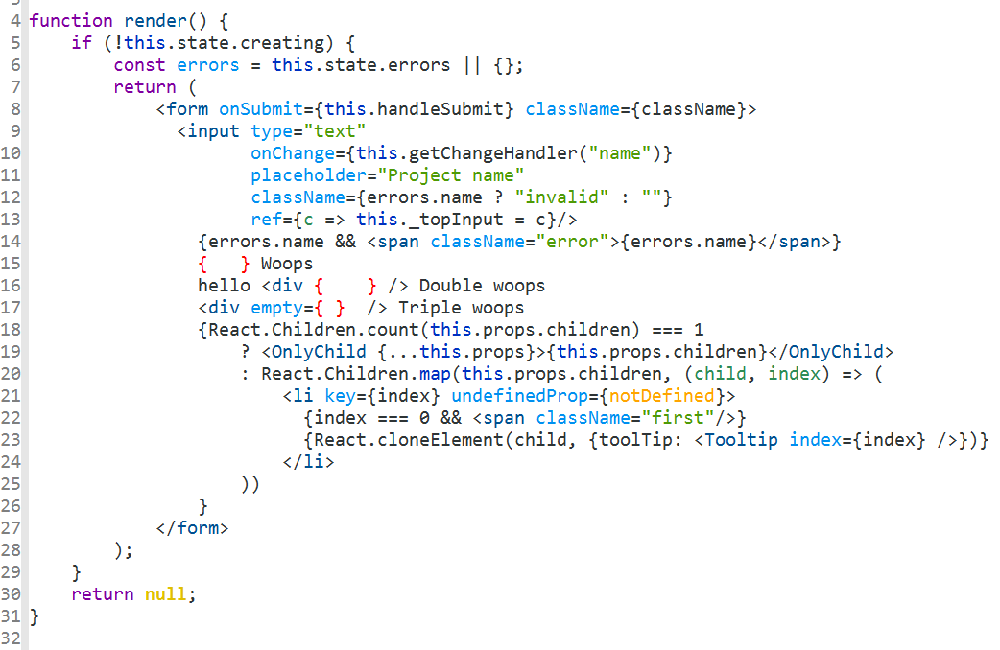
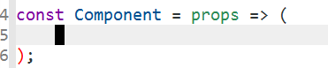

# rjsx-mode: A major mode for editing JSX files
[](https://melpa.org/#/rjsx-mode)
[](https://travis-ci.org/felipeochoa/rjsx-mode)

This mode derives from `js2-mode`, extending its parser to support JSX syntax
according to the [official spec](https://facebook.github.io/jsx/).  This
means you get all of the `js2` features plus proper syntax checking
and highlighting of JSX code blocks.

Here's a screenshot of it in action:




## Installing

`rjsx-mode` is available on [Melpa](https://melpa.org/), so if you have that
repository configured you can just `package-list-packages` and install it from there.
(If not, you can follow [their guide](https://melpa.org/#/getting-started) on
getting started). `rjsx-mode` automatically registers itself for `*.jsx` files,
but you can use `(add-to-list 'auto-mode-alist '("components\\/.*\\.js\\'" . rjsx-mode))`

Alternatively, you can download `rjsx-mode.el` from this repository and use
`load-file` or similar to add it to your current session.

## Features

`js2-mode` does not include a JSX parser, but rather an E4X parser, which
means it gets confused with certain JSX constructs. This mode extends the
`js2** parser to support all JSX constructs and proper syntax highlighting
and **indentation**.

`rjsx-mode` adds some electricity to `<` and `C-d` to make adding new
JSX elements less repetitive:

* `<` inserts `</>` whenever it would start a new JSX node (and simply
  inserts `<` otherwise)
* `>` or `C-d` right before the slash in a self-closing tag
  automatically inserts a closing tag and places point inside the
  element

The result is you can do the following:



* `C-c C-r` lets you rename the enclosing tag

Some features that this mode adds to `js2`:

* Proper indentation of JSX regardless of how you write it. (No need to wrap
  in parentheses!)
* Highlighting JSX tag names and attributes (using the `rjsx-tag` and
  `rjsx-attr` faces)
* Parsing the spread operator `{...otherProps}`
* `&&` and `||` in child expressions `<div>{cond && <BigComponent/>}</div>`
* Ternary expressions `<div>{toggle ? <ToggleOn /> : <ToggleOff
  />}</div>`

If you don't like this behavior, you can disable it by adding the following to
your init file:

```elisp
(with-eval-after-load 'rjsx-mode
  (define-key rjsx-mode-map "<" nil)
  (define-key rjsx-mode-map (kbd "C-d") nil)
  (define-key rjsx-mode-map ">" nil))
```

Additionally, since `rjsx-mode` extends the `js2` AST, utilities using the
parse tree gain access to the JSX structure.

### Indentation

`rjsx-mode` extends the built-in javascript indentation engine to correctly
support JSX. You can configue the depth of indentation using `js-indent-level`
and `sgml-basic-offset`, along with the various `js-indent-` variables.

**Indenting with tabs**: This is not currently supported. You can either submit
a PR if interested (look at issue #85) or revert to using the built-in
indentation mode by adding `(setq-local indent-line-function
'js-jsx-indent-line)` to your `rjsx-mode-hook`.

## Bugs, contributing

Please submit any bugs or feature requests on the GitHub tracker. Since this
mode is based on `js2`, it is possible that bugs you encounter with it stem from
there. Please try reproducing bugs using `js2-mode` if relevant. If the bug
is in `js2`, please report it using `M-x report-emacs-bug`.

## License

This project is licensed under the MIT license.
